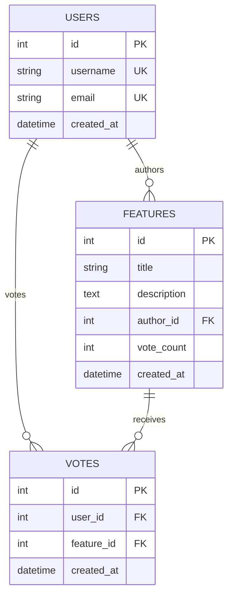
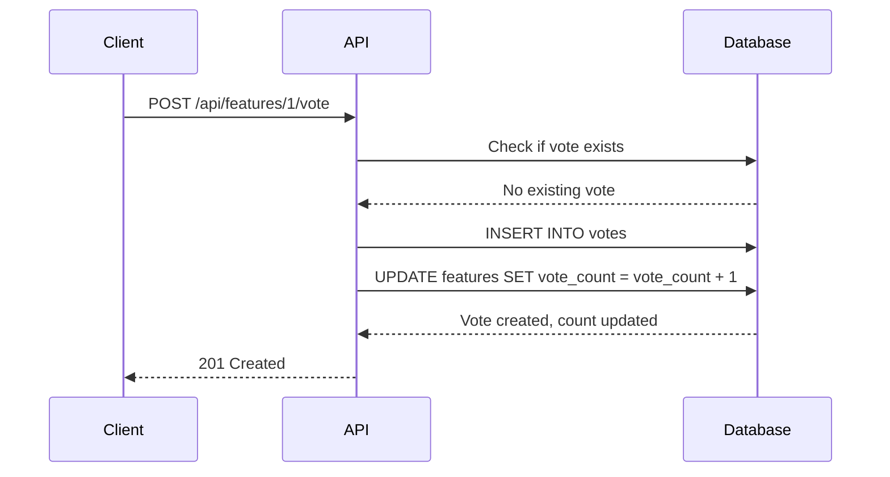
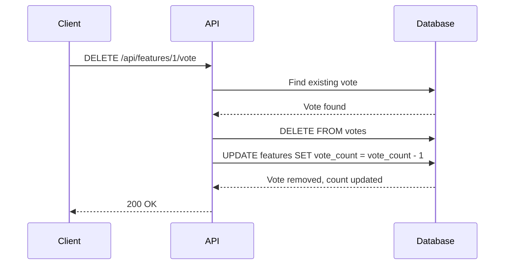

# Database Schema

Complete database schema documentation for the Feature Voting System. The database uses PostgreSQL with SQLAlchemy ORM and Alembic migrations.

## 🗄️ Schema Overview

The database consists of three main entities: Users, Features, and Votes, with a many-to-many relationship between Users and Features through the Votes table.



## 📋 Table Definitions

### Users Table

Stores user profile information and authentication data.

| Column | Type | Constraints | Description |
|--------|------|-------------|-------------|
| `id` | INTEGER | PRIMARY KEY, AUTO INCREMENT | Unique user identifier |
| `username` | VARCHAR | NOT NULL, UNIQUE | User's display name |
| `email` | VARCHAR | NOT NULL, UNIQUE | User's email address |
| `created_at` | TIMESTAMP | NOT NULL, DEFAULT NOW() | Account creation timestamp |

#### Indexes
- `ix_users_id`: Primary key index (automatic)
- `ix_users_username`: Unique index for fast username lookups
- `ix_users_email`: Unique index for fast email lookups

#### Constraints
- `username`: 2-50 characters, unique across all users
- `email`: Valid email format, unique across all users

#### SQL Definition
```sql
CREATE TABLE users (
    id SERIAL PRIMARY KEY,
    username VARCHAR(50) NOT NULL UNIQUE,
    email VARCHAR(255) NOT NULL UNIQUE,
    created_at TIMESTAMP WITH TIME ZONE DEFAULT NOW()
);

CREATE UNIQUE INDEX ix_users_username ON users (username);
CREATE UNIQUE INDEX ix_users_email ON users (email);
```

#### Example Data
```sql
INSERT INTO users (username, email) VALUES
('alice_dev', 'alice@example.com'),
('bob_designer', 'bob@example.com'),
('charlie_pm', 'charlie@example.com');
```

### Features Table

Stores feature requests and proposals submitted by users.

| Column | Type | Constraints | Description |
|--------|------|-------------|-------------|
| `id` | INTEGER | PRIMARY KEY, AUTO INCREMENT | Unique feature identifier |
| `title` | VARCHAR | NOT NULL | Feature title/summary |
| `description` | TEXT | NOT NULL | Detailed feature description |
| `author_id` | INTEGER | NOT NULL, FOREIGN KEY → users.id | Feature author |
| `vote_count` | INTEGER | NOT NULL, DEFAULT 0 | Cached vote count |
| `created_at` | TIMESTAMP | NOT NULL, DEFAULT NOW() | Feature creation timestamp |

#### Indexes
- `ix_features_id`: Primary key index (automatic)
- `ix_features_title`: Index for searching by title
- `ix_features_vote_count`: Index for sorting by popularity (implicit on ORDER BY)

#### Constraints
- `title`: 3-100 characters, required
- `description`: 10-1000 characters, required
- `author_id`: Must reference existing user
- `vote_count`: Non-negative integer

#### SQL Definition
```sql
CREATE TABLE features (
    id SERIAL PRIMARY KEY,
    title VARCHAR(100) NOT NULL,
    description TEXT NOT NULL,
    author_id INTEGER NOT NULL REFERENCES users(id),
    vote_count INTEGER NOT NULL DEFAULT 0,
    created_at TIMESTAMP WITH TIME ZONE DEFAULT NOW()
);

CREATE INDEX ix_features_title ON features (title);
CREATE INDEX ix_features_vote_count ON features (vote_count DESC);
```

#### Example Data
```sql
INSERT INTO features (title, description, author_id) VALUES
('Dark Mode Support', 'Add dark theme option for better UX in low-light environments', 1),
('Push Notifications', 'Real-time notifications for feature updates and votes', 2),
('API Rate Limiting', 'Implement rate limiting to prevent API abuse and ensure fair usage', 1);
```

### Votes Table

Tracks voting relationships between users and features.

| Column | Type | Constraints | Description |
|--------|------|-------------|-------------|
| `id` | INTEGER | PRIMARY KEY, AUTO INCREMENT | Unique vote identifier |
| `user_id` | INTEGER | NOT NULL, FOREIGN KEY → users.id | Voting user |
| `feature_id` | INTEGER | NOT NULL, FOREIGN KEY → features.id | Target feature |
| `created_at` | TIMESTAMP | NOT NULL, DEFAULT NOW() | Vote timestamp |

#### Indexes
- `ix_votes_id`: Primary key index (automatic)
- `_user_feature_vote`: Unique composite index preventing duplicate votes

#### Constraints
- **Unique Constraint**: `(user_id, feature_id)` - prevents duplicate votes
- `user_id`: Must reference existing user
- `feature_id`: Must reference existing feature

#### SQL Definition
```sql
CREATE TABLE votes (
    id SERIAL PRIMARY KEY,
    user_id INTEGER NOT NULL REFERENCES users(id),
    feature_id INTEGER NOT NULL REFERENCES features(id),
    created_at TIMESTAMP WITH TIME ZONE DEFAULT NOW(),
    CONSTRAINT _user_feature_vote UNIQUE (user_id, feature_id)
);

CREATE INDEX ix_votes_user_id ON votes (user_id);
CREATE INDEX ix_votes_feature_id ON votes (feature_id);
```

#### Example Data
```sql
INSERT INTO votes (user_id, feature_id) VALUES
(1, 2),  -- alice votes for push notifications
(2, 1),  -- bob votes for dark mode
(3, 1),  -- charlie votes for dark mode
(1, 3);  -- alice votes for rate limiting
```

## 🔗 Relationships

### User → Features (One-to-Many)
- **Relationship**: A user can author multiple features
- **Foreign Key**: `features.author_id → users.id`
- **Cascade**: ON DELETE RESTRICT (prevent deleting users with features)

### User → Votes (One-to-Many)
- **Relationship**: A user can cast multiple votes
- **Foreign Key**: `votes.user_id → users.id`
- **Cascade**: ON DELETE CASCADE (remove votes when user is deleted)

### Feature → Votes (One-to-Many)
- **Relationship**: A feature can receive multiple votes
- **Foreign Key**: `votes.feature_id → features.id`
- **Cascade**: ON DELETE CASCADE (remove votes when feature is deleted)

### User ↔ Features (Many-to-Many through Votes)
- **Relationship**: Users can vote for multiple features, features can be voted on by multiple users
- **Junction Table**: `votes`
- **Constraint**: One vote per user per feature

## 📊 Data Flow Diagrams

### Vote Creation Flow


### Vote Removal Flow


## 🔍 Query Patterns

### Common Queries

#### Get Features with Vote Counts (Sorted by Popularity)
```sql
SELECT f.id, f.title, f.description, f.vote_count, f.created_at,
       u.username as author_name
FROM features f
JOIN users u ON f.author_id = u.id
ORDER BY f.vote_count DESC, f.created_at DESC
LIMIT 20 OFFSET 0;
```

#### Check if User Has Voted for Feature
```sql
SELECT EXISTS(
    SELECT 1 FROM votes
    WHERE user_id = $1 AND feature_id = $2
) as has_voted;
```

#### Get User's Voting History
```sql
SELECT f.id, f.title, v.created_at as voted_at
FROM votes v
JOIN features f ON v.feature_id = f.id
WHERE v.user_id = $1
ORDER BY v.created_at DESC;
```

#### Feature Analytics
```sql
SELECT
    COUNT(*) as total_features,
    AVG(vote_count) as avg_votes_per_feature,
    MAX(vote_count) as most_votes,
    COUNT(CASE WHEN vote_count = 0 THEN 1 END) as features_with_no_votes
FROM features;
```

### Performance Optimizations

#### Index Usage
```sql
-- Fast user lookup by username
EXPLAIN SELECT * FROM users WHERE username = 'alice_dev';
-- Uses: ix_users_username

-- Fast feature sorting by popularity
EXPLAIN SELECT * FROM features ORDER BY vote_count DESC LIMIT 20;
-- Uses: ix_features_vote_count

-- Fast duplicate vote check
EXPLAIN SELECT * FROM votes WHERE user_id = 1 AND feature_id = 2;
-- Uses: _user_feature_vote (unique constraint index)
```

#### Query Performance Tips
1. **Use Indexes**: All foreign keys and frequently queried columns are indexed
2. **Limit Results**: Always use LIMIT for list queries
3. **Avoid N+1**: Join tables instead of separate queries for relationships
4. **Cache Vote Counts**: The `vote_count` column avoids expensive COUNT queries

## 🛠️ Database Operations

### Migrations with Alembic

#### Creating Migrations
```bash
# Auto-generate migration from model changes
alembic revision --autogenerate -m "Add user preferences table"

# Create empty migration for custom changes
alembic revision -m "Add custom indexes"
```

#### Migration File Structure
```python
"""Add user preferences table

Revision ID: 002
Revises: 001
Create Date: 2024-01-01 12:00:00.000000
"""

def upgrade() -> None:
    # Migration operations
    op.create_table('user_preferences',
        sa.Column('id', sa.Integer(), nullable=False),
        sa.Column('user_id', sa.Integer(), nullable=False),
        sa.Column('theme', sa.String(), nullable=True),
        sa.ForeignKeyConstraint(['user_id'], ['users.id'], ),
        sa.PrimaryKeyConstraint('id')
    )

def downgrade() -> None:
    # Rollback operations
    op.drop_table('user_preferences')
```

### Data Maintenance

#### Vote Count Synchronization
```sql
-- Recalculate vote counts (run periodically)
UPDATE features SET vote_count = (
    SELECT COUNT(*) FROM votes WHERE feature_id = features.id
);
```

#### Data Cleanup
```sql
-- Remove orphaned votes (shouldn't happen with foreign keys)
DELETE FROM votes
WHERE user_id NOT IN (SELECT id FROM users)
   OR feature_id NOT IN (SELECT id FROM features);
```

#### Database Statistics
```sql
-- Update table statistics for query optimization
ANALYZE users;
ANALYZE features;
ANALYZE votes;
```

## 📈 Scaling Considerations

### Read Replicas
For high-read workloads:
```python
# Use read replicas for queries
features = session.execute(
    select(Feature).order_by(Feature.vote_count.desc())
).bind_to(read_replica_engine)
```

### Partitioning
For large datasets, consider partitioning:
```sql
-- Partition votes by date
CREATE TABLE votes_2024 PARTITION OF votes
FOR VALUES FROM ('2024-01-01') TO ('2025-01-01');
```

### Caching Strategy
- **Application Cache**: Cache popular features list
- **Database Cache**: Use PostgreSQL shared_buffers
- **Redis Cache**: Cache vote counts and user sessions

## 🔒 Security Considerations

### Data Protection
1. **Sensitive Data**: Email addresses should be encrypted in production
2. **Access Control**: Implement row-level security for multi-tenant scenarios
3. **Audit Trail**: Consider adding audit columns (updated_at, updated_by)

### Backup Strategy
```bash
# Daily database backup
pg_dump feature_voting_db > backup_$(date +%Y%m%d).sql

# Point-in-time recovery setup
wal_level = replica
archive_mode = on
archive_command = 'cp %p /backup/archive/%f'
```

## 🧪 Test Data Setup

### Development Data
```sql
-- Create test users
INSERT INTO users (username, email) VALUES
('test_user_1', 'test1@example.com'),
('test_user_2', 'test2@example.com'),
('test_user_3', 'test3@example.com');

-- Create test features
INSERT INTO features (title, description, author_id, vote_count) VALUES
('Test Feature 1', 'Description for test feature 1', 1, 5),
('Test Feature 2', 'Description for test feature 2', 2, 3),
('Test Feature 3', 'Description for test feature 3', 1, 8);

-- Create test votes
INSERT INTO votes (user_id, feature_id) VALUES
(1, 2), (1, 3),
(2, 1), (2, 3),
(3, 1), (3, 2), (3, 3);
```

### Performance Test Data
```sql
-- Generate large dataset for performance testing
INSERT INTO users (username, email)
SELECT
    'user_' || i,
    'user_' || i || '@example.com'
FROM generate_series(1, 10000) i;

INSERT INTO features (title, description, author_id)
SELECT
    'Feature ' || i,
    'Description for feature ' || i,
    (random() * 10000)::int + 1
FROM generate_series(1, 1000) i;
```

## 📚 Additional Resources

### Database Monitoring
- Use `pg_stat_statements` for query performance monitoring
- Monitor connection counts with `pg_stat_activity`
- Track table sizes with `pg_total_relation_size()`

### Useful PostgreSQL Extensions
```sql
-- Enable useful extensions
CREATE EXTENSION IF NOT EXISTS "uuid-ossp";  -- UUID generation
CREATE EXTENSION IF NOT EXISTS "pg_stat_statements";  -- Query stats
CREATE EXTENSION IF NOT EXISTS "pg_trgm";  -- Text search optimization
```

---

For complete project documentation, see the [main README.md](README.md).